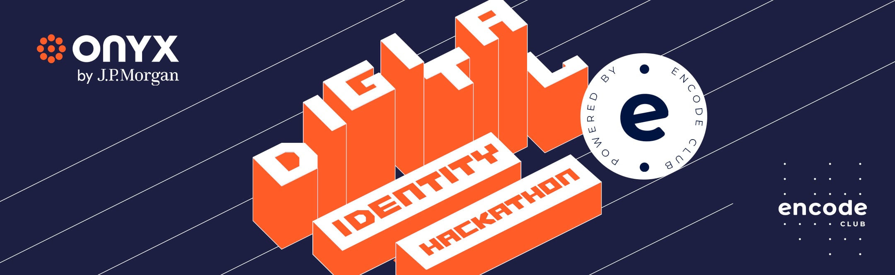

# Digital Identity Hackathon

## Hands.link: Your Decentralized Social Connection
Hands.link is a revolutionary decentralized social mobile app built using cutting-edge technologies such as Expo, React Native, and the Lens Protocol – a Web3 social graph built on the Polygon Proof-of-Stake blockchain. Designed to empower users with control over their social interactions, Hands.link offers a decentralized social experience like no other.


## Key Features:

🔍 View Posts: Explore a dynamic feed of posts shared by users within the Hands.link community.

👤 View and Search Profiles: Discover and connect with like-minded individuals by exploring user profiles and utilizing our robust search functionality.

**Future Features in the Pipeline:**

🔐 Authentication: Securely manage your profile and interactions with built-in authentication features.

💬 Follow Profiles: Stay connected with your favorite users by following their profiles.

✍️ Post Publications: Share your thoughts, experiences, and creativity with the world through publications.

💬 Comment: Engage in meaningful discussions by commenting on posts and publications.

🔄 Mirror and Follow: Share content from other users and build a following of your own.

✉️ Direct Messaging (DM): Connect with other users through private messaging.

🔔 Notifications: Stay informed with real-time notifications for interactions and updates.

💰 Revenue System: Monetize your content by creating paywalls for exclusive follows and premium publications.

Hands.link is not just a social network; it's a movement towards a decentralized and user-centric social experience. Join us on this exciting journey, where you take control of your social connections and content.

## Demo Video

[](https://www.youtube.com/watch?v=U-BE2Tg2fgI)


## Getting Started

To get started with Hands.link, follow these steps:

1. Clone this repository to your local machine.
2. Install the dependencies
    ```
    npm install
    ```
3. Run the app
    ```
    npx expo start
    ```

## About the Hackathon



Unleash your creativity at the Digital Identity Hackathon - an intense 4-week innovation sprint, challenging technophiles to reinvent the future of online identity security and privacy!

Start date: 12th September 2023

Submission date: 8th October 2023

Finale and Prizegiving: 24th October